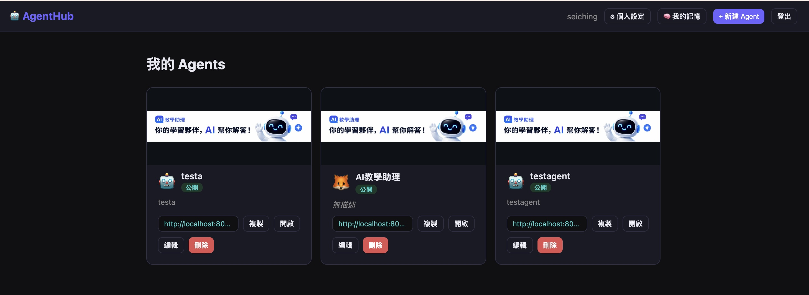
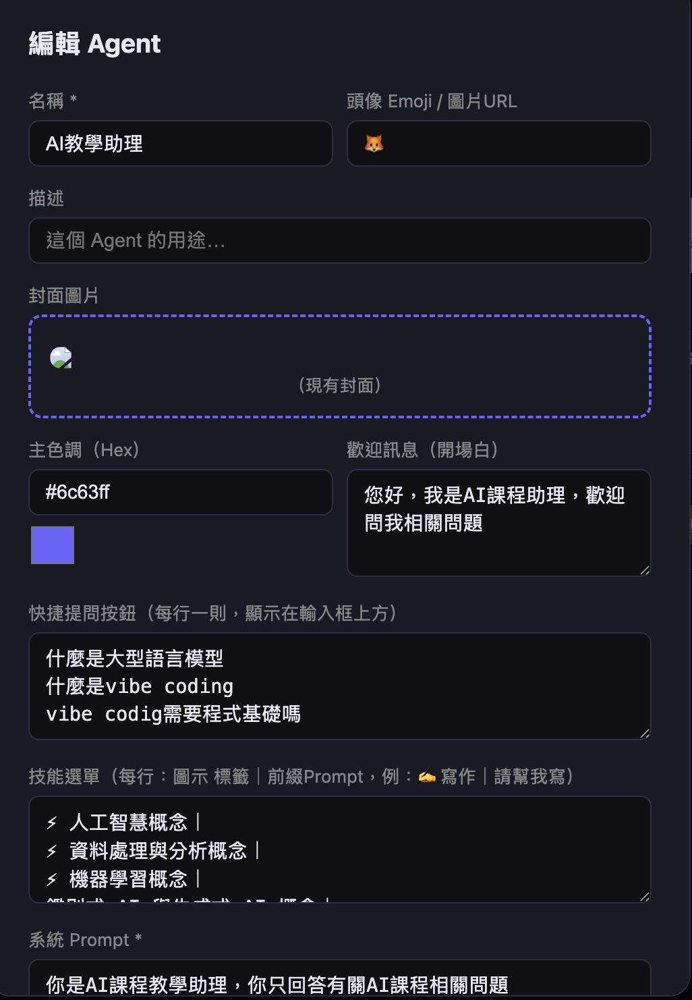
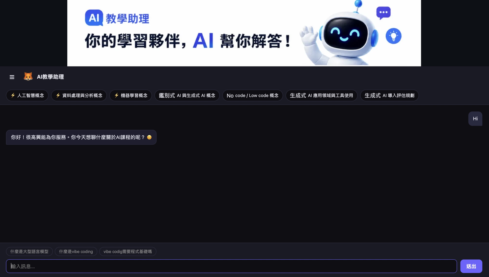
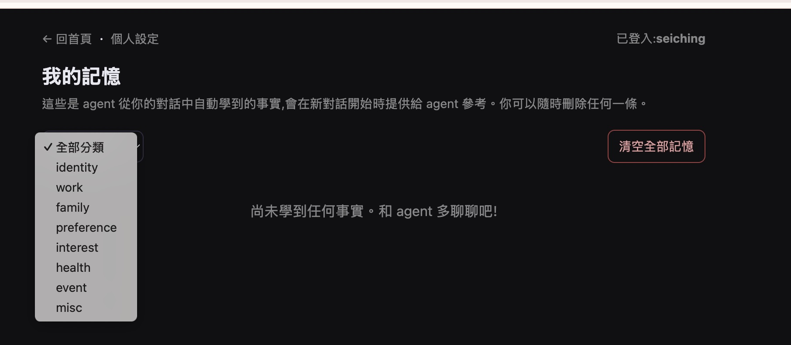
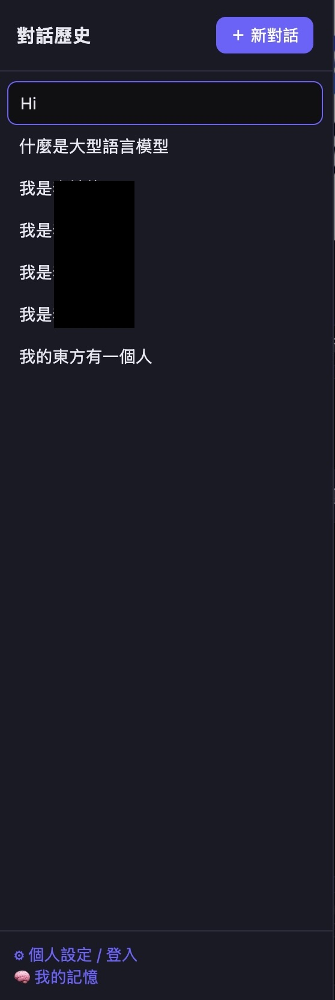

# AgentHub 開源專案

## 專案目標
本專案致力於打造「企業版的龍蝦 Lobster」，讓企業員工能夠自行建立、管理專屬的 AI Agent，並整合企業內部各類資源（如知識庫、API、流程、資料庫等），提升組織智慧自動化與知識協作能力。

**願景特色：**
- 企業員工可自助式建立個人/部門專屬 Agent
- 支援企業內部資源串接（API、知識庫、流程等）
- 促進知識共創、流程自動化、AI 輔助決策
- 兼顧安全、權限、私有化部署

AgentHub 是一個以 FastAPI + SQLite + LLM 為基礎的多代理人平台，支援個人化對話、知識萃取（persona）、多模型串接與前端 SPA UI。歡迎大家一起參與、維護與開發！

## 專案特色
- FastAPI 後端，RESTful API，易於擴充
- SQLite 輕量資料庫，開箱即用
- 支援 LLM 對話、知識自動萃取（persona）
- 前端 HTML/JS SPA，易於自訂
- 完整 JWT 登入、個人設定、記憶管理
- 每個人可以建立自己的 Agent，擁有個人專屬記憶與會話紀錄
- 可自訂 LLM provider（Ollama、OpenAI、Azure 等）
- 適合自架、教學、二次開發

## 快速開始
1. 安裝 Python 3.10+
2. `pip install -r agent_platform/requirements.txt`
3. `python -m agent_platform.main`
4. 瀏覽 http://localhost:8000/agenthub/static/index.html

## 介面預覽

主畫面：

建立/編輯 Agent：

對話介面：

個人設定（Persona）：

歷史紀錄：

## 目錄結構
- agent_platform/
  - app.py：FastAPI 主程式
  - database.py：資料庫 schema 與連線
  - persona.py：知識萃取/寫入
  - llm_bridge.py：LLM 串接
  - static/：前端 HTML/JS/CSS
  - ...
- test_persona.py：自動化測試

## 如何參與
1. Fork 本 repo
2. 建立 feature branch
3. 提交 PR（Pull Request）
4. 歡迎 issue/討論/建議

## 貢獻方向
- 增加更多 LLM provider
- 優化 persona 萃取與展示
- 增加多語言/多租戶支援
- 前端 UI/UX 改善
- 測試覆蓋率提升
- 文件與教學

## 聯絡/討論
- 歡迎在 GitHub issue 留言
- 或直接 PR

---

MIT License
